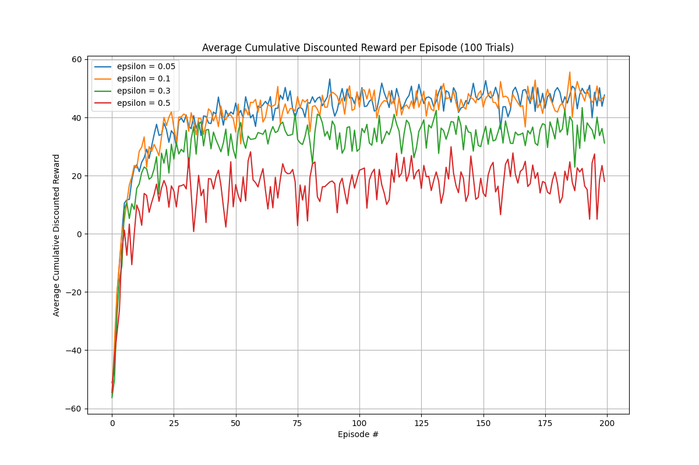

# CS885

## Part 1: MDP 演算法比較 - 結果討論與分析

本次實驗結果清楚地展示了價值迭代（Value Iteration）、策略迭代（Policy Iteration）以及修改版策略迭代（Modified Policy Iteration）在解決馬可夫決策過程（MDP）問題時的特性與差異。

首先，比較標準的價值迭代與策略迭代。**價值迭代 (Value Iteration)** 需要 **26 次**迭代才能收斂，而**策略迭代 (Policy Iteration)** 僅需 **6 次**。這個顯著的差異源於兩種演算法的核心機制。策略迭代的每次迭代都包含一個「完整」的策略評估步驟（透過解線性方程組得到當前策略下最精確的價值函數），這使得它能更快地找到最佳策略，因此外部迭代次數較少。然而，解線性方程組的計算成本非常高，特別是在狀態空間很大時。相對地，價值迭代的每次迭代計算非常快（只是一個簡單的 Bellman 更新），但它需要更多次的迭代來讓價值函數逐漸收斂到最佳值。最終，兩者找到了相同的最佳策略。

### 修改版策略迭代 (Modified Policy Iteration)

1.  **與價值迭代的關係：**
    當部分策略評估的迭代次數 (`nIterPPE`) 設為 `1` 時，修改版策略迭代的總收斂次數為 **26 次**，這與價值迭代的結果**完全相同**。這是因為，在這種設定下，演算法的行為等同於價值迭代：每進行一次 Bellman 更新（部分評估），就馬上進行一次策略改進（取 argmax）。

2.  **效能的權衡：**
    隨著 `nIterPPE` 的增加（從 `2` 到 `7`），總收斂迭代次數顯著下降。這說明在每次策略改進之前，花費更多的計算來獲得一個更準確的價值函數估計，可以讓策略的「品質」提升得更快，從而減少了達到最佳策略所需的總迭代輪數。

3.  **與策略迭代的關係：**
    當 `nIterPPE` 增加到 `7` 次以後，總迭代次數穩定在 7 或 8 次左右。這個數字非常接近策略迭代所需的 6 次。這表明，在這個特定的迷宮問題中，進行大約 7 次的 Bellman 更新，就足以讓價值函數的估計非常接近「完整」評估的結果。再增加評估次數（如 8, 9, 10）對策略改進的幫助已經很小，因此總迭代次數不再顯著下降。

### Part 1 結論

總結來說，這些結果驗證了演算法的理論。價值迭代和策略迭代是求解 MDP 的兩個極端方法。修改版策略迭代則提供了一個彈性的中間方案，允許我們透過調整 `nIterPPE` 參數，在「單次迭代的計算成本」與「收斂所需的總迭代次數」之間做出權衡。在實際應用中，選擇一個合適的 `nIterPPE` 可以找到計算效率上的最佳點，使其比單純的價值迭代或策略迭代更快地解決問題。

---

## Part 2: Q-Learning 探索率分析 - 結果討論與分析

本實驗旨在探討 Q-learning 演算法中，不同探索率 (Exploration Probability, `epsilon`) 對於 **Agent** 在迷宮環境中學習效率與最終成果的影響。實驗結果完美體現了**探索 (Exploration) 與利用 (Exploitation) 之間的權衡**。

### 實驗結果圖表

### 圖表分析與討論

這張圖表清楚地展示了 `epsilon` 值如何影響 **Agent** 的學習過程。

#### 1. 學習速度 (初期階段, Episodes 0-50)

* **高探索率 (`ε = 0.3, 0.5`) 的初期優勢**: 在訓練初期，`ε = 0.5` (紅色) 和 `ε = 0.3` (綠色) 的曲線爬升速度最快。這說明較高的探索率能讓 **Agent** 更快地發現環境中的關鍵資訊（如高獎勵的目標或高懲罰的陷阱），從而迅速建立對環境的初步認知。

* **低探索率 (`ε = 0.05, 0.1`) 的初期學習較慢**: `ε = 0.05` (藍色) 和 `ε = 0.1` (橘色) 的曲線在初期爬升較為平緩。這是因為它們傾向於「利用」已知的、哪怕不是最佳的路徑，導致探索新路徑的速度變慢。

#### 2. 最終策略表現 (收斂階段, Episodes 50-200)

* **低探索率 (`ε = 0.05, 0.1`) 的最終表現最佳**: 隨著訓練的進行，橘色和藍色曲線最終達到了最高的平均獎勵（穩定在 40 到 55 之間）。這表明，一旦 **Agent** 找到了接近最佳的策略，較低的探索率能讓它**最大化地「利用」**這些學到的知識，從而穩定地獲得高分。

* **中等探索率 (`ε = 0.3`) 的表現次之**: 綠色曲線雖然初期學習很快，但最終的平均獎勵卻穩定在一個較低的水平。原因在於，即使學到了好策略，仍有 **30% 的機率會選擇隨機動作**，這種持續的探索行為阻礙了它穩定地執行最佳路徑。

* **高探索率 (`ε = 0.5`) 的表現最差**: 紅色曲線的最終表現最差。**50% 的探索率意味著 Agent 有一半的時間都在「胡亂嘗試」**，而不是執行學到的最佳策略，導致它幾乎無法穩定地獲得高分。

### Part 2 結論

1.  **Epsilon 的選擇是一個關鍵的權衡**：太低的 epsilon 可能導致學習速度慢；太高的 epsilon 則會妨礙 **Agent** 利用已學到的知識，導致最終表現不佳。
2.  **最佳策略**：在本次實驗中，`ε = 0.05` 和 `ε = 0.1` 提供了最佳的平衡，它們的探索性足以找到最佳路徑，利用性也足夠高，能夠在找到路徑後持續獲得高分。
3.  **對 Q-value 和策略的影響**：一個合適的 epsilon 能幫助演算法收斂到更準確的 Q-value，從而導出最佳策略。過高的 epsilon 會因為持續的隨機行為引入太多「噪音」，使得 Q-value 難以穩定收斂。
